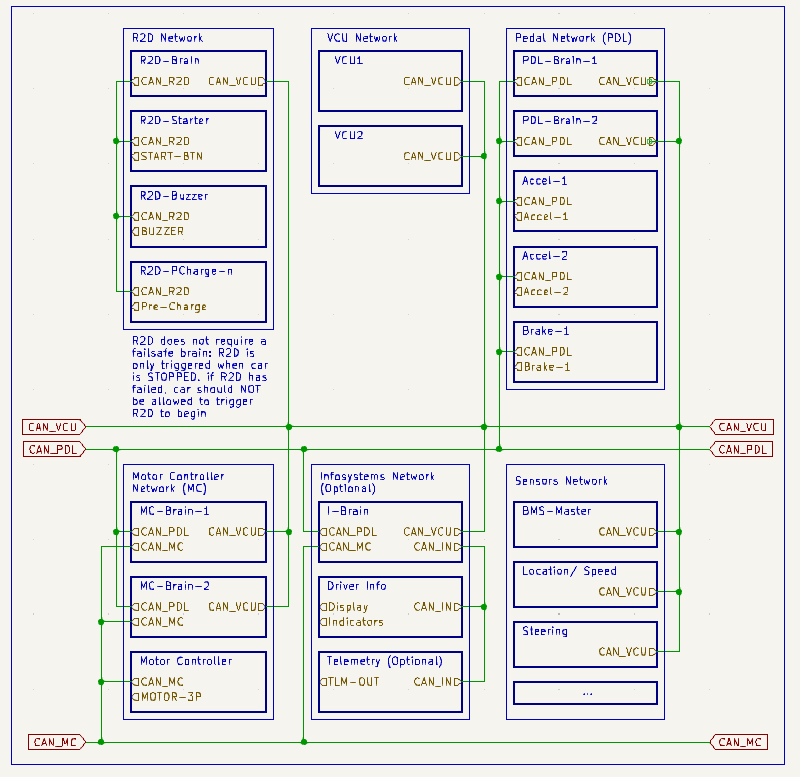

# NVF Controls

This is the main repository for the [Nanyang Venture Formula](.) Racing Team's data acquisition subsystem. Contents for work and their documentation includes:

## Overall System Architecture

We strife to adopt the "1 Job" modality, where every node in every system should only do 1 Job, and be best at it.

Enough? We think not! Each component will have a failsafe. The system is deisgned in a way that there **should** not have any single point of failures (at least for critical components). For example, there are 2 Vehicle Control Units (VCUs) that both serve the same purpose and run **concurrently**.

To segregate systems, seperate CanBus networks will be used.

### 1 Job Nodes

There are 2 types of "1 Job" Nodes:

1. Input
   - measuring and transmitting in the CanBus network the node's reading
2. Output
   - polling the CanBus network for instructions, manipulating a output, setting its state ON/OFF depending on the instructions given by the brain(s).
   - (if neccessary) poll and check for implausbility and failure in a brain node

### Brain Nodes

**Subsystem level** - Brain Nodes are nodes usually makes small (low priority) decisions for the subsystem. other jobs include:

1. Connecting 2 CanBus networks together
   - relaying messages from 1 network to another (status report/ decision requests)
2. Performing heartbeat and plausibility checks for all nodes in the subsystem. (this includes the other brain node in the system)

---

**VCU level** - Brain Nodes are nodes that make major decisions for the entire car and all its subsystems.

1. Maintaining the stateMachine and transmitting the car's state to all subsystems
2. Performing heartbeat and plausibility checks for all nodes in its system. (this includes the other brain node in the system)
3. Taking in all inputs (from user and from car), deciding major actions to be performed (ie. Stopping Car due to safety check failure) and promugating this "Order" to all subsystems and its nodes.
4. (as needed) collate all information and transmit to infosystem subsystem to be reflected back to driver (instrument cluster) and/or remote engineers (via telemetry)

## Control Systems

- [APPS](./apps.md)
- [Ready 2 Go (R2D)](./R2D.md)

## Custom Printed Circuit Boards (PCBs)

- [1Job Lite](.)
